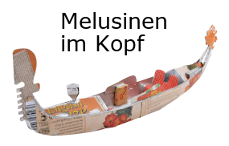
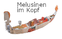
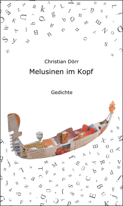

## Seidlvilla

derzeit auf www.seidlvilla.de: `Melusinen_im_Kopf.png`

<<< wird von www.seidlvilla.de geholt - wenn es sicht dort ändert, dann auch hier wenn es dort umbenannt wird, dann erscheint es hier *nicht mehr*.

---

### Neu
`gross-285x182_02-Gondel+Titel.png`:

---

### Alt
`klein-125x080_04-Gondel-B0-T2.png`:

-

`gross-285x479_01-Cover(front).png`:

